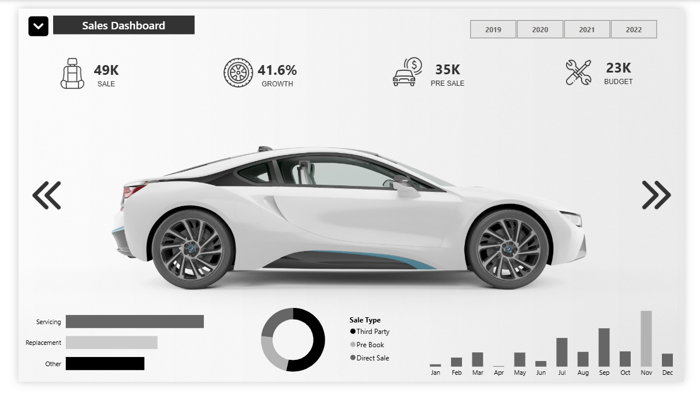

# 🚗 Raw Car Dashboard  

## 📌 Project Overview  
This project aims to analyze car sales data and create an **interactive dashboard** that displays key **KPIs (Key Performance Indicators)** to track sales performance and growth trends.  

---

## 🛠️ Technologies Used  
- **Excel** for data analysis and processing  
- **Power BI** for dashboard visualization  
- **DAX** for KPI calculations and data analysis  

---

## 📊 Key KPIs in the Dashboard  
- **🔹 Current Year Sales:** Total sales for the current year  
- **📈 Sales Growth:** Sales growth percentage compared to the previous year  
- **📊 Previous Year Sales:** Total sales for the previous year  
- **📉 Sales Trend:** Analysis of sales trends over different time periods  

---
## 🧮 Calculation 

```DAX
Category_Switch = var cate = SELECTEDVALUE(Orders[Category])
var _type = SWITCH(TRUE(),cate="Office Supplies","Digital Watch","Furniture","Analog Watch","Technology","Other")
return _type

```
## 📊 Previous Year Sales
```DAX
Previous_year_sales = CALCULATE(SUM(Orders[Sales]),YEAR(Orders[Order Date])= 2021)

```
## 📈 Sales Growth

```DAX
Sales_growth = DIVIDE(([Current_year_sales]-[Previous_year_sales]),[Previous_year_sales]) 

```
---
## How to Use
1. Clone the repository:
   ```bash
   git clone https://github.com/MohamedAhmeddiye/Raw_Car_Dashboard.git
   ```
2. Open the `Dashboard.pbix` file in Power BI Desktop.
3. Explore the pages and interact with the visualizations.

## Overview

[Live demo ](https://app.powerbi.com/groups/me/reports/6e60af5a-d538-43fa-8061-9a7d892b9fea?ctid=8fcf4cd9-2fe4-4571-8431-b17c3f29efb3&pbi_source=linkShare)
---
> [!NOTE]  
✅ This project is a **practical training in data analysis** using BI tools.  
✅ The data used in this project is **sample data** and not real business data.  
✅ The dashboard can be improved by adding additional insights, such as **geographical analysis** or **customer segmentation**.  

---

> [!TIP]
> Use **filters and interactions** within the dashboard for deeper insights.  
> Try **trend analysis** to observe seasonal sales variations.  
> Add **sales forecasting** to estimate future performance.  

---

> [!WARNING]  
> **This project is for learning and training purposes only.** The data used in this analysis is **not real** and should not be used for actual business decisions.  

---

> [!CAUTION]  
- The data presented in this project may not reflect real business scenarios.  
- This analysis should not be used as a basis for making financial or strategic decisions.  
- Always refer to **verified data sources** before implementing any data-driven decisions.  

---

## 🚀 How to Get Started?  
1. Download the **data file** and load it into **Excel / Power BI**.  
2. Open the **dashboard** and explore insights through interactive visuals.  
3. Modify formulas or filters to analyze the data as needed.  

---

## 😊Feedback

If you have any suggestions or feedback, feel free to open an issue or connect with me on [LinkedIn](linkedin.com/in/mohammed-ahmed-052769239).

---
## 📑License
This project is licensed under the MIT License. See the `LICENSE` file for details.

### 🏆 **Thank you for exploring this project!** Feel free to reach out if you have any questions. 🚀